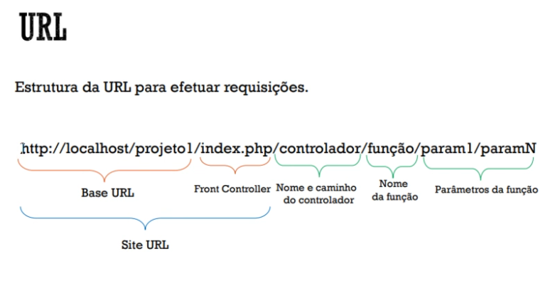

# Codeigniter co Grocery CRUD

Libs Usadas:

- https://www.grocerycrud.com/
- https://jeromejaglale.com/doc/php/codeigniter_template
- https://getbootstrap.com/docs/4.3/getting-started/download/

+ Tradução pt_BR core e no Grocery.


## Anotações dos vídeos 

- URL para efetuar requisições



#### controller + view base

- application/views/crud/index.php

```html
<!doctype html>
<html lang="pt_BR">
<head>
	<meta charset="UTF-8">
	<meta name="viewport"
		  content="width=device-width, user-scalable=no, initial-scale=1.0, maximum-scale=1.0, minimum-scale=1.0">
	<meta http-equiv="X-UA-Compatible" content="ie=edge">
	<title>GROCERY TESTE</title>
	<?php
		foreach ($css_files as $css){
			echo "<link rel='stylesheet' href='$css' />";
		}
	?>
</head>
<body>

<?php
	echo $output;
?>

<?php
foreach ($js_files as $js){
	echo "<script src='$js' ></script>";
}
?>
</body>
</html>

```

- application/controllers/Users.php

```php
<?php
defined('BASEPATH') OR exit('No direct script access allowed');

class Users extends CI_Controller {

	public function index()
	{
		$crud = new Grocery_CRUD();
		$crud->set_table("usuario");

		$form = $crud->render();
		$this->load->view("crud/index", $form);
		//var_dump($form);

		// aula 11
	}
}

```

#### exemplos de configurações do form

```php
<?php
defined('BASEPATH') OR exit('No direct script access allowed');

class Users extends CI_Controller {

	public function index()
	{
		$crud = new Grocery_CRUD();
		$crud->set_table("usuario");

		// campos obrigatórios
		$crud->required_fields("nome","login","senha","tipo", "confirma");

		// colunas com dados únicos(não permitir dados iguais)
		$crud->unique_fields("login");

		// mudar tipo de campo
		$crud->field_type("senha", "password");
		$crud->field_type("confirma", "password");

		// limitar campos no cadastro e edição
		// $crud->fields("nome","login");

		// campos para cadastro | aparece todos os campos na edição
		$crud->add_fields("nome");

		//alterando ordem no cadastro
		//$crud->fields("tipo","nome","login","senha","data_nascimento");

		// Adição de dado adicional
		$crud->fields("tipo","nome","login","senha","confirma","data_nascimento");

		// mudar rótulo do campo
		$crud->display_as("confirma","Confirma senha");

		// definir quais colunas exibir
		$crud->columns("nome","tipo");

		// alterar o nome "Adicionar Registro"
		$crud->set_subject("Usuário");

		// permitir/tirar funções (editar/excluir)
		// $crud->unset_delete();
		// $crud->unset_add();

		//VALIDAÇÕES
		// usa o mesmo do CI
		$crud->set_rules("nome","Nome","min_length[3]");
		$crud->set_rules("confirma","Confirma senha","matches[senha]");

		// Salvar dados, retirando o campo "confirma" pois não existe no BD
		$crud->callback_before_insert(array($this,"remove_confirma"));// chama função antes de inserir algo

		// render sempre no final!
		$form = $crud->render();
		$this->load->view("crud/index", $form);
		//var_dump($form);

		// aula 11
	}

	public function remove_confirma($post_array){
		unset($post_array['confirma']);

		$post_array["senha"] = md5($post_array["senha"]); // criptografando senha

		return $post_array;
	}
}

```
